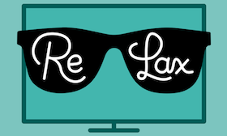

# Re:Lax [](https://github.com/Carthage/Carthage) [](https://cocoapods.org/?q=ReLax) [](https://choosealicense.com/licenses/mit/)


[**From the tvOS HIG**](https://developer.apple.com/tvos/human-interface-guidelines/user-interaction/)

>  If your app uses UIKit and the focus API to implement its user interface, the motion and visual effects of the focus model apply to your interface elements. This makes your app feel native to the platform and helps reduce friction as people move through your interface. When people use the Siri Remote with your app, they’ll find transitioning between focusable elements fluid and intuitive.

Apple have a few ways to create parallax effects using only tools. Parallax previewer is a stand alone application that can have image layers added to it and can be exported as an LCR file, which is Apple's proprietary parallax file format. They also provide a Photoshop plugin that can export a PSD file as an LCR file. Lastly, there is a command line utility, `layerutil`, that can export LSR or PSD files into an LCR file.

---

### Re:Lax in Action

**ReLax alleviates the need to use Apple's tools by providing two ways out. It provides custom parallax effects to any programmatic view as well as the ability to generate a parallax LCR file _at runtime!_ See for yourself:**

<p align="center">
  
</p>

---

# LCR Files

LCR files are most useful when creating Top Shelf extensions that display dynamic parallax content. If your app retrieves layered images from a server at runtime, you must provide those images as `LCR` files. `LCR` files are generated from `.lsr` or Photoshop files using the `layerutil` command-line tool that’s installed with Xcode, or by using `ParallaxPreviewer.app`. This process does not scale when creating parallax files for dynamic content; fortunately, ReLax fixes this.

We have reverse engineered the `LCR` image format in order to make this convenient for content providers. This can be done _on the fly_ without the need to use a server to distribute the parallax image files. ReLax makes programmatically generating `LCR` files within your app or extension a breeze.

```swift
let parallaxImage = ParallaxImage(images: images)
let lcrImage: UIImage = parallaxImage.image()
```

You also have access to the raw image data if you'd rather write the image to a file to save for later

```swift
try parallaxImage.imageData().write(to: someFileUrl, options: [])
```

The Example app includes a TopShelf extension which demonstrates how to dynamically create LCR files at runtime and display them on the Top Shelf

---

# Programmatic Effect

**ReLax** makes creating programmatic parallax effects easy by providing a constructor that takes an array of `UIImage`s

```swift
let parallaxView = ParallaxView(images: images)
```

For more flexibility, `ParallaxView` can be constructed with a `layerContainer` which is a custom view that will apply the parallax effect to all subviews. An `effectMultiplier` is also available if you want to force the parallax effect to be more subtle.

```swift
// The Parallax Effect is applied to this view, made up of a UIImageView and a UILabel
class ParallaxImageView: UIView, ParallaxContainer {
    private let imageView: UIImageView()
    private let label: UILabel()

    // ...

    func setupView(with image: UIImage, text: String) {
        imageView.iamge = image
        label.text = text
    }

    func focusChanged(_ focus: ParallaxFocusState) {}
    func parallaxShadow(forFocus: ParallaxFocusState, defaultShadow: Shadow) -> Shadow? {
        return defaultShadow
    }
}

class ParallaxCell: UICollectionViewCell {
    private let parallaxView: ParallaxView<ParallaxImageView>
    private let container: ParallaxImageView

    init(container: ParallaxImageView) {
        container = layerContainer
        parallaxView = ParallaxView(layerContainer: container, effectMultiplier: 1.0)
        super.init(frame: .zero)
        addSubview(parallaxView)
    }

    override var isHighlighted: Bool {
        didSet {
            if isFocused {
                let focus: ParallaxFocusState = isHighlighted ? .focusedDepressed : .focused
                parallaxView.setFocusState(focus, animationType: .animated)
            }
        }
    }

    override func didUpdateFocus(in context: UIFocusUpdateContext, with coordinator: UIFocusAnimationCoordinator) {
        super.didUpdateFocus(in: context, with: coordinator)
        parallaxView.didUpdateFocus(in: context, with: coordinator)
    }
}
```

## Requirements

* tvOS 9.0
* Xcode 8

## License

ReLax is available using an MIT license. See the LICENSE file for more info.

## We'd Love to Know If You're Using ReLax!

Tweet us at [@marksands](https://twitter.com/marksands) or [@JARInteractive](https://twitter.com/JARInteractive) to let us know if you're using the library :+1:
